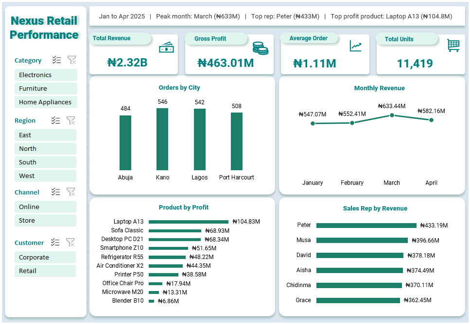

# nexus-retail-performance-analysis
An end-to-end retail sales and profit performance analysis of 2,000+ transactions using Excel. Features key business insights, pivot tables, dynamic calculations, and an interactive executive dashboard.

# Nexus Retail Performance Analysis

## Overview
Nexus Retail Performance Analysis is an end-to-end business intelligence and data analytics project evaluating multi-region retail transactions. Using Microsoft Excel, this project transforms raw operational sales data into structured data models, calculated KPIs, and an interactive executive dashboard designed to evaluate revenue trends, regional performance, sales representative output, and product profitability.

---

## Dashboard & Visualizations


### Key Executive Highlights (Jan – Apr 2025)
* **Total Revenue:** ₦2.32B across 11,419 total units sold.
* **Gross Profit:** ₦463.01M with an Average Order Value (AOV) of ₦1.11M.
* **Peak Performance Month:** March generated peak revenue reaching ₦633.44M.
* **Top Revenue Generator:** Sales Rep Peter led total sales with ₦433.19M.
* **Most Profitable Product:** Laptop A13 generated highest profit at ₦104.83M.
* **Interactive Slicers:** Dynamic filtering enabled for Category, Region, Channel, and Customer Type.

---

## Business Problem
Nexus Retail needed a structured performance evaluation across its physical store and online sales channels. Key stakeholders lacked clear visibility into:
1. Product profit margins vs. total sales volume.
2. Regional order distribution across key operational hubs (Abuja, Kano, Lagos, Port Harcourt).
3. Individual sales representative performance and revenue contribution.
4. Monthly revenue trends and seasonality patterns.

---

## Objectives
* Clean and structure raw transactional data for analysis in Microsoft Excel.
* Calculate core retail key performance indicators (KPIs) including Total Revenue, Gross Profit, Average Order Value, and Total Units Sold.
* Perform multi-dimensional analysis across regions, sales channels, product categories, and sales reps.
* Build a dynamic, interactive Excel dashboard featuring custom slicers and clear chart hierarchy for executive decision-making.
* Provide actionable, data-backed business recommendations to improve profitability and operational efficiency.

---

## Dataset
* **Data Source:** `[Nexus_Retail_Performance.xlsx]`
* **Time Horizon:** January 2025 – April 2025
* **Scale:** 2,000+ transactional records
* **Key Attributes:** Order ID, Date, Region, City, Sales Representative, Customer Segment, Sales Channel, Product Category, Product Name, Units Sold, Unit Price, Total Revenue, Cost of Goods Sold (COGS), Profit Margin.

---

## Tools & Technologies
* **Microsoft Excel:** Data cleaning, conditional logic, Pivot Tables, Pivot Charts, and dashboard design.
* **Excel Functions Used:** `SUM`, `AVERAGE`, `COUNTIF`/`SUMIF`, `XLOOKUP`/`INDEX MATCH`, `TEXT` (for date formatting), `IF`/`IFS` logic.
* **Data Visualization:** Pivot Charts, Custom KPI Cards, Interactive Slicers, and Formatted Bar/Line Visuals.

---

## Data Preparation
1. **Data Cleaning & Formatting:**
   * Handled missing, duplicate, or inconsistent transactional entries.
   * Standardized date fields into consistent monthly formats (`Jan 2025` – `Apr 2025`).
   * Standardized currency fields to Nigerian Naira (₦).
2. **Feature Engineering & Calculations:**
   * Calculated **Gross Profit** per transaction (`Total Revenue - COGS`).
   * Calculated **Average Order Value (AOV)** across customer segments and regions.
   * Categorized sales channels into **Online** vs. **Store** modalities.
3. **Data Modeling:**
   * Built structured summary Pivot Tables to serve as the backend data engine for dynamic charting.

---

## Analysis
The analysis focused on four core performance angles:
1. **Temporal Trends:** Monthly revenue trajectory from January (₦547.07M) climbing to peak in March (₦633.44M) before a slight contraction in April (₦582.16M).
2. **Geographic Distribution:** Order volume analysis across Abuja (484), Kano (546), Lagos (542), and Port Harcourt (508).
3. **Sales Representative Breakdown:** Revenue attribution per sales rep, with Peter leading (₦433.19M), followed by Musa (₦396.66M), David (₦378.18M), Aisha (₦374.49M), Chidinma (₦370.11M), and Grace (₦362.45M).
4. **Product Profitability:** Evaluating bottom-line margin contribution, identifying high-margin drivers like Laptop A13 (₦104.83M), Sofa Classic (₦68.93M), and Desktop PC D21 (₦68.34M) versus low-margin items like Blender B10 (₦6.86M).

---

## Key Findings
* **Peak Seasonality:** Revenue accelerated consistently from January through March, driven primarily by corporate volume spikes before scaling back in April.
* **Balanced Regional Volume:** Kano (546) and Lagos (542) led order counts, though order distribution across all four key cities remains remarkably balanced.
* **Consistent Rep Output:** Sales rep individual contributions are tightly clustered between ₦362M and ₦433M, indicating strong team baseline performance.
* **Product Profit Concentration:** Technology and home electronics (Laptop A13, Desktop PC D21, Smartphone Z10) generate the majority of overall gross profit, while lower-priced home items yield thin margins.

---

## Business Recommendations
1. **Capitalize on High-Margin Categories:** Increase marketing expenditure and inventory stocking for high-profit drivers like **Laptop A13** and **Sofa Classic**.
2. **Sales Incentive Structure:** Implement target bonuses for sales reps nearing the top tier to push individual revenue performance beyond the ₦400M threshold.
3. **Regional Target Optimization:** Leverage high order density in Kano and Lagos by expanding local fulfillment options to reduce delivery times and boost channel efficiency.
4. **Product Bundle Strategies:** Pair low-margin accessories (e.g., Blender B10, Microwave M20) with high-ticket electronics to raise basket size and overall unit profit margins.

---

## Limitations
* **Time Range:** Dataset covers a 4-month snapshot (Jan–Apr 2025), limiting full annual seasonality modeling.
* **External Factors:** Macroeconomic variables, market inflation, and competitor pricing data were not present in the dataset.

---

## Project Structure
```text
nexus-retail-performance-analysis/
│
├── README.md                      # Comprehensive project documentation
├── Nexus_Retail_Dashboard.png     # Dashboard screenshot image file
└── Nexus_Retail_Performance.xlsx # Main Excel workbook (data, pivots, dashboard)

```

---

## How to Reproduce the Analysis

1. **Clone or Download:** Download the repository ZIP file or clone it using Git:
```bash
git clone [https://github.com/your-username/nexus-retail-performance-analysis.git](https://github.com/your-username/nexus-retail-performance-analysis.git)

```


2. **Open in Microsoft Excel:** Launch `Nexus_Retail_Performance.xlsx` using Microsoft Excel (2016 or newer recommended).
3. **Interact with Dashboard:** Navigate to the `Dashboard` worksheet tab and use the left-side slicers (**Category**, **Region**, **Channel**, **Customer**) to filter the analytical views.

---

## Key Skills Demonstrated

* Data Cleaning & Formatting
* Financial & Sales Metric Calculation (KPIs)
* Pivot Tables & Summary Aggregations
* Interactive Executive Dashboard Design
* Data Storytelling & Business Reporting

```
